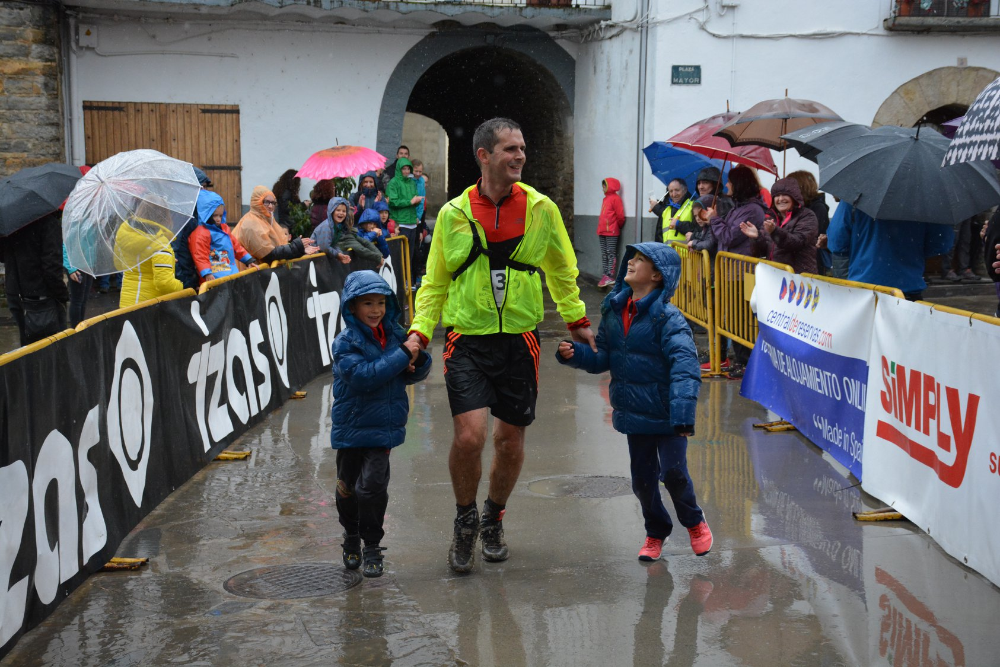
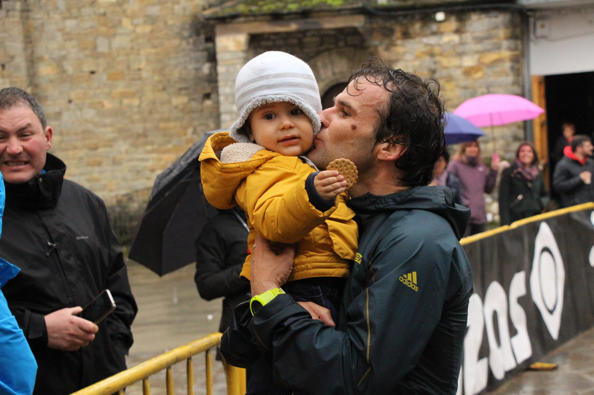

<!DOCTYPE html>
<html lang="es">
<head>
    <meta charset="UTF-8">
    <meta http-equiv="X-UA-Compatible" content="IE=edge">
    <meta name="viewport" content="width=device-width, initial-scale=1.0">
    <title>TRAIL VALLE DE LA FUEVA</title>
    <link rel="icon" href="imagenes/logo.básico.jpg" type="image" sizes="16x16">
</head>
<body>
    <h1>V Edición Trail Valle de la Fueva</h1>
    
<strong>Sábado 2 de Abril de 2022</strong>

    
<em>Lugar Tierrantona (La Fueva)</em>

    
Horarios de salida carreras

    <ol>
        <li>42K 9:30</li>
        <li>35K 9:45</li>
        <li>25K 10:00</li>
        <li>16K 10:15</li>
    </ol>
    
Lugar salida

    <iframe src="https://www.google.com/maps/embed?pb=!1m18!1m12!1m3!1d188637.17947686647!2d0.12947641989808228!3d42.375432977508964!2m3!1f0!2f0!3f0!3m2!1i1024!2i768!4f13.1!3m3!1m2!1s0x12a7e8670c266477%3A0x4018c6508ce9f80!2sLa%20Fueva%2C%20Huesca!5e0!3m2!1ses!2ses!4v1638992513020!5m2!1ses!2ses" width="600" height="450" style="border:0;" allowfullscreen="" loading="lazy"></iframe>
       
Requisitos mínimos inscripción

    <ul>
        <li>Año nacimiento anterior a 2001</li>
        <li>Licencia Fedme o Fam</li>
        <li>Reconocimiento médico especial pruebas deportivas realizado 6 meses antes de la fecha de la carrera</li>
        <li>Pasaporte Covid</li>
    </ul>
      <a  href="formulario/formulario.html"><H2>FORMULARIO DE INSCRIPCION</H2></a>
    <h2>Nuestras redes sociales</h2>

    <a href="https://www.instagram.com/trailvalledelafueva/?hl=es">INSTAGRAM</a>
    <a href="https://es-es.facebook.com/trailvalledelafueva/">FACEBOOK</a>

    <h2>Fotos anteriores ediciones</h2>
    
    
    <iframe width="560" height="315" src="https://www.youtube.com/embed/t48amQMNAbI" title="YouTube video player" frameborder="0" allow="accelerometer; autoplay; clipboard-write; encrypted-media; gyroscope; picture-in-picture" allowfullscreen></iframe>
 
    <h3>Tabla Clasificatoria 4º Edición</h3>
    <table border="1">
        <tr>
            <th>Puesto</th>
            <th>Nombre</th>
            <th>Club</th>
        </tr>
        <tr>
            <td>1º</td>
            <td>Juan Garces</td>
            <td>BioFrutal</td>
        </tr>
        <tr>
            <td>2º</td>
            <td>Ruben Gonzalez</td>
            <td>Trail Running Huesca</td>
        </tr>
        <tr>
            <td>3º</td>
            <td>Alberto Lopez</td>
            <td>Club Atlético Sobrarbe</td>
        </tr>
        <tr>
            <td>4º</td>
            <td colspan="2">Julio Serrano</td>
        </tr>
    </table>
  

Ultima modificación 09/12/2021 por José Ángel Gracia Pera    
</body>
</html>
